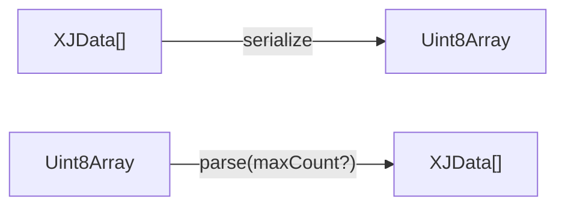

# @flinbein/xjmapper

A high-performance binary serialization library for JavaScript/TypeScript that supports a wide range of data types including primitives, typed arrays, objects, arrays, and errors.

## Supported Types Overview

The library supports serialization and deserialization of the following JavaScript types:

- ✅ **Primitives**: `null`, `undefined`, `boolean`, `number`, `bigint`, `string`
- ✅ **Binary Data**: `ArrayBuffer`, all TypedArray types (`Int8Array`, `Uint8Array`, `Float32Array`, etc.)
- ✅ **Collections**: Arrays (`Array`), Plain Objects (`Object`)
- ✅ **Errors**: `Error` objects with stack traces and causes
- ❌ **Not Supported**: Functions, Symbols, Classes, Dates, RegExp, Maps, Sets
- ❌ **Circular References**: Objects and arrays with circular/recursive references will throw an error

**Note**: The library detects and prevents serialization of circular references to avoid infinite loops. If you attempt to serialize an object or array that references itself (directly or indirectly), the `serialize` function will throw an error with the message "wrong xj format: recursive".

### Data Flow Architecture



## Installation

```bash
npm install @flinbein/xjmapper
```

## Basic Usage

```typescript
import { parse, serialize } from "@flinbein/xjmapper";

// Serialize multiple values
const data = serialize({foo: "bar"}, "hello", 42, true);

// Parse the serialized data
const [obj, str, num, bool] = parse(data);

console.log(obj);  // {foo: "bar"}
console.log(str);  // "hello"
console.log(num);  // 42
console.log(bool); // true
```

## API Reference

### `serialize(...values: XJData[]): Uint8Array`

Serializes one or more values into a compact binary format.

**Parameters:**
- `values` - Any number of serializable values

**Returns:** `Uint8Array` containing the serialized data

### `parse(data: ArrayBuffer | TypedArray | DataView | string, maxCount?: number): XJData[]`

Parses serialized binary data back into JavaScript values.

**Parameters:**
- `data` - Binary data to parse (ArrayBuffer, TypedArray, DataView, or string)
- `maxCount` - Optional maximum number of values to parse (default: Infinity)

**Returns:** Array of parsed values

## Supported Data Types

### Primitives

```typescript
// null and undefined
serialize(null, undefined);

// Booleans
serialize(true, false);

// Numbers (integers and floats)
serialize(42, -123, 3.14159, Math.PI, Infinity, -Infinity, NaN);

// BigInts
serialize(123n, -456n, 123456789012345678901234567890n);

// Strings
serialize("hello", "🐲🐲🐲", "");
```

### Binary Data

```typescript
// ArrayBuffer
const buffer = new ArrayBuffer(10);
serialize(buffer);

// Typed Arrays
serialize(
  Int8Array.of(1, 2, 3),
  Int16Array.of(1000, 2000),
  Int32Array.of(100000, 200000),
  Uint8Array.of(255, 254, 253),
  Uint16Array.of(65535, 65534),
  Uint32Array.of(4294967295, 4294967294),
  Uint8ClampedArray.of(255, 256, 300), // values clamped to 0-255
  Float32Array.of(3.14, 2.71),
  Float64Array.of(Math.PI, Math.E),
  BigInt64Array.of(123n, -456n),
  BigUint64Array.of(123n, 456n)
);
```

### Complex Types

```typescript
// Arrays
serialize([1, "hello", true], [[1, 2], [3, 4]], []);

// Objects (plain objects only)
serialize(
  {name: "John", age: 30},
  {nested: {data: [1, 2, 3]}},
  {} // empty object
);

// Errors
const error = new Error("Something went wrong");
const errorWithCause = new Error("Main error", {cause: new Error("Root cause")});
serialize(error, errorWithCause);
```

## Examples

### Serializing Mixed Data

```typescript
import { parse, serialize } from "@flinbein/xjmapper";

const user = {
  id: 123,
  name: "Alice",
  scores: Float32Array.of(95.5, 87.2, 92.1),
  active: true,
  metadata: null
};

const settings = {
  theme: "dark",
  notifications: true
};

// Serialize multiple objects
const serialized = serialize(user, settings);

// Parse them back
const [parsedUser, parsedSettings] = parse(serialized);

console.log(parsedUser.scores instanceof Float32Array); // true
console.log(parsedUser.scores[0]); // 95.5
```

### Working with Binary Data

```typescript
// Create some binary data
const binaryData = Uint8Array.of(0x48, 0x65, 0x6c, 0x6c, 0x6f); // "Hello" in ASCII
const buffer = binaryData.buffer;

// Serialize different views of the same data
const serialized = serialize(
  buffer,
  binaryData,
  new DataView(buffer)
);

const [parsedBuffer, parsedArray, parsedView] = parse(serialized);

console.log(parsedBuffer instanceof ArrayBuffer); // true
console.log(parsedArray instanceof Uint8Array);   // true
```

### Error Handling

```typescript
try {
  throw new Error("Database connection failed", {
    cause: new Error("Network timeout")
  });
} catch (error) {
  // Serialize the error
  const serialized = serialize(error);
  
  // Parse it back
  const [parsedError] = parse(serialized);
  
  console.log(parsedError instanceof Error);     // true
  console.log(parsedError.message);              // "Database connection failed"
  console.log(parsedError.cause instanceof Error); // true
}
```

### Partial Parsing

```typescript
// Serialize many values
const data = serialize("first", "second", "third", "fourth");

// Parse only the first 2 values
const firstTwo = parse(data, 2);
console.log(firstTwo); // ["first", "second"]

// Parse all values
const all = parse(data);
console.log(all); // ["first", "second", "third", "fourth"]
```

### Working with Large Data

```typescript
// Create a large typed array
const largeArray = new Float64Array(1000000);
for (let i = 0; i < largeArray.length; i++) {
  largeArray[i] = Math.random();
}

// Serialize efficiently
const serialized = serialize(largeArray, "metadata", 42);

// Parse back
const [parsedArray, metadata, number] = parse(serialized);

console.log(parsedArray instanceof Float64Array); // true
console.log(parsedArray.length); // 1000000
console.log(metadata); // "metadata"
console.log(number);   // 42
```

## Type Definitions

```typescript
type XJPrimitive = undefined | null | boolean | number | bigint | string | ArrayBuffer | TypedArray;
type XJArray = readonly XJData[];
type XJRecord = { readonly [key: string]: XJData };
type XJData = Error | XJPrimitive | XJArray | XJRecord;
```

## Features

- **Compact Binary Format**: Optimized encoding for different data types
- **Type Preservation**: All JavaScript types are preserved during serialization/deserialization
- **Multiple Values**: Serialize and parse multiple values in a single operation
- **Partial Parsing**: Parse only the number of values you need
- **Error Support**: Serialize Error objects with stack traces and causes
- **Large Data Support**: Efficiently handle large typed arrays and buffers
- **Zero Dependencies**: No external dependencies

## Performance

The library is optimized for performance with:
- Compact encoding for small integers (0-15 fit in a single byte)
- Efficient string encoding for short strings
- Direct binary copying for typed arrays
- Minimal memory allocation during parsing

## Browser Compatibility

Works in all modern browsers and Node.js environments that support:
- TypedArrays
- TextEncoder/TextDecoder
- BigInt (for BigInt serialization)

## License

MIT
